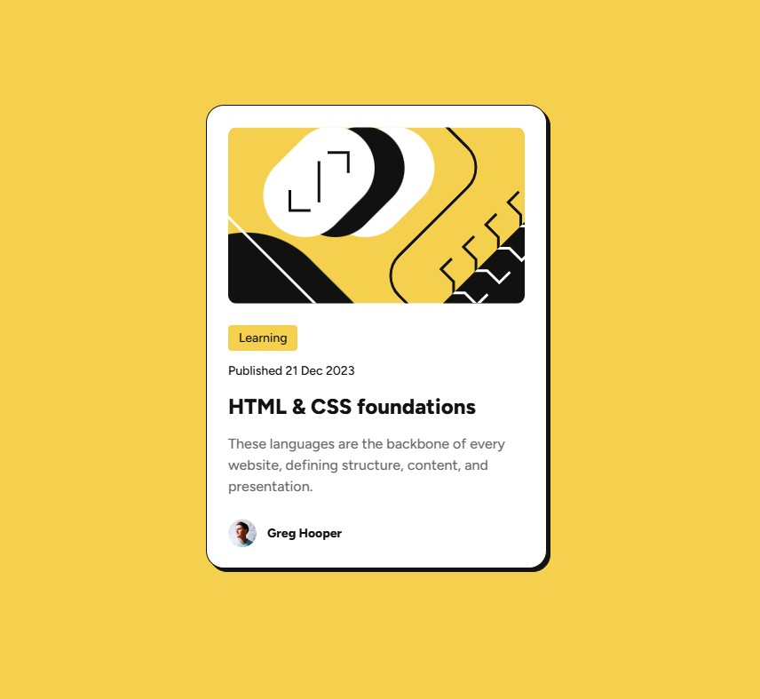

# Frontend Mentor - Blog preview card solution

## Overview

This challenge was to build and deploy Frontend Mentor's Blog preview card challenge.  Frontend Mentor provided various assets including the images, figma file, and style guide.

[Frontend Mentor Blog preview card challenge](https://www.frontendmentor.io/challenges/blog-preview-card-ckPaj01IcS)

This was a basic challenge requiring only css and HTML knowledge.

### Screenshot

### Links

- Solution URL: [github repository](https://github.com/ClassPython/fem-blog-preview-card)
- Live Site URL: [github-pages]( https://classpython.github.io/fem-blog-preview-card/)

### Built with

- Semantic HTML5 markup
- CSS properties
- Flexbox

### What I learned

 Utilized Flexbox to center component and CSS clamp function to create fluid typography.

 

